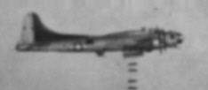

VALOR TO VICTORY

 

## VALOR TO VICTORY 34TH BOMB GROUP

  
  

THIS WEB SITE IS SPONSORED FOR THE MONTH OF SEPTEMBER 2004  

In Memory of James M. Glass and In Honor of the Glass Crew by Donald L. Shee.  

THE GLASS CREW  

James M. Glass, Pilot (deceased)  

Charles R. (Bob) Yockey, Co-Pilot  

Herbert D. Roy, Navigator  

Sherwood L. Simmons, Toggleer  

Frederick P. Aldridge, Radio Operator  

Charles A. Herget, Flight Engineer  

Benjamin Zeldes, Ball Turret Gunner  

Donald L. Shee, Waist Gunner  

William C. Hetherington, Tail Gunner  

Winnie Witch, Canine Mascot (deceased)  
  
  

DEDICATION  

This site is dedicated to the men who served this country in the 34th Bomb Group and its support units. Here you will find the histories of the planes and crews that made up the 34th Bomb Group. We also remember and honor the ground crews that kept the B-24s and later B-17s flying on mission after mission.
  
  

This site is especially dedicated to my uncle, Dexter Burwell Jordan, 7th Squadron Crew Chief. His charges included the B-24, "The Near Sighted Robin" and the B-17, "Sweet Seventeen." T/Sgt Jordan received the Bronze Star for sending his planes out on over 100 missions without an abort atributed to mechanical failure. He also received the Soldier's Medal for putting out a fire on a B-17 on its hardstand. Had the plane exploded it could easily have killed upward of 20 ground crew members who were totally unaware of the dangerous situation that had developed close by their position.
  
  

I am always looking for additional photos of 34th BG planes, crews and station life. If you or your loved one served in the 34th BG and you have a story to share or a photo scrapbook that might add to the site, please feel free to contact me. You may reach me at the following email address. "ferrellumm@netscape.net"
  
  

Gary Ferrell  

Archivist and Historian  

34th BG Association  

September 18, 2004  
  

  

Dex Jordan on the bicycle with Fuelling, Schmoldt, and Englehart  
  
  

34th BOMB GROUP ASSOCIATION MEMBERSHIP NOTICE  

At the 2004 Reunion a new Treasurer was elected, Bonnie Zylsta. Bonnie, however, is not yet set up to begin receiving membership dues, so the former treasurer, Hal Province has agreed to continue collecting the dues until further notice. The only problem is, Hal has recently moved, so please take note of his new address listed here.   
SEND DUES to Hal Province, 31 Shore Crest Cir, Carriere, MS 39426\. Hal's phone number remains the same.   

Please pass this information along to any vets you know who do not have internet access.  

  
  

REUNION INFORMATION  

2004 Reunion: September 8-12, 2004 at the Marriott in Dayton, Ohio.  

This year's reunion was another great event. 196 registered their attendance. On Friday we enjoyed a wonderful tour of the Air Force Museum and Saturday was highlighted by the morning Membership Meeting and the evening Gala Banquet.
  
  

CALLING ALL GROUND CREW MEMBERS! YOUR HELP IS NEEDED NOW!  

[NEW PAGE ADDED ON CREW CHIEFS AND GROUND CREW MEMBERS](CrewChiefs.md)
  

On this new page, dedicated to the Ground Crews that kept the bombers flying, I am listing all of the known Crew Chiefs, by Squadron, along with any available information on the men that worked with the Crew Chiefs and the planes they maintained. Except for the MOS number 750 on the passenger lists of the men being deployed to England and those flying home after the war, none of this information appears in the official records of the group. I will need your help to make this page anywhere close to complete. If you worked on a ground crew, please let me know the name of the Crew Chief and possibly the names or numbers of the planes you helped maintain. The ground crews always seem to get scant mention in the unit histories. Let's do together what we can to correct that situation where the 34th Bomb Group is concerned.  

Send replies to me, Gary Ferrell at ferrellumm@netscape.net.  
  

MORE HELP WANTED!!!  

I would like to add information and photos about the other aircraft at Mendlesham besides the B-24s and B-17s. I know there was an early P-51 and later a P-47. There was also a Piper L-4, a C-78 Bobcat, an A-20, a C-64 Nouseman and possibly other aircraft. Please contact me with any information and/or photos of these planes.  

I would also like to have information on the ground equipment used by the 34th BG, like the Cletrac shown above. Again, please contact me with information and/or photos of 34th BG jeeps, trucks, firetrucks, ambulances, etc. THANKS.  

Send replies to me, Gary Ferrell at ferrellumm@netscape.net.
  
  
  

 [Search this site](http://search.freefind.com/find.html?id=20300229) powered by [FreeFind](http://www.freefind.com) |
  
  

THE MEN  

[Personnel sent to England by sea](1Apr44.md)  

[The Original Crews](Originalcrews.md)  

[Record of May 1944 Training Flights](1944-05TF.md)  

[Crews by Crew Number](CrewNumbers.md)  

[Post-war Passenger List](passengers.md)  

[Honored Dead](HonoredDead.md)  

[Crew Chiefs and Ground Crew](CrewChiefs.md)NEW!!! Help Wanted!  

[Combat crew records](000crews.md)  

  
  

THE MISSIONS  

[May 1944 B-24 Missions](1944-05.md)  

[June 1944 B-24 Missions](1944-06.md)  

[July 1944 B-24 Missions](1944-07.md)  

[August 1944 B-24 Missions](1944-08.md)  

[September 1944 B-17 Missions](1944-09.md)  

[October 1944 B-17 Missions](1944-10.md)  

[November 1944 B-17 Missions](1944-11.md)  

[December 1944 B-17 Missions](1944-12.md)  

[January 1945 B-17 Missions](1945-01.md)  

[February 1945 B-17 Missions](1945-02.md)  

[March 1945 B-17 Missions](1945-03.md)  

[April 1945 B-17 Missions](1945-04.md)  

[May 1945 Chowhound \& other Post-war Missions](1945-05.md)  

  
  

THE PLANES  

[B-24 Individual Combat Records](000b24s.md)  

[B-17 Individual Combat Records](000b17s.md)  

  
  
  

  
  
  

NOTICE: All articles and photographs on this site are copyright protected by the donor and the 34th Bomb Group Association. Use of these is expressely forbidden without written consent of the association historian.  
  

