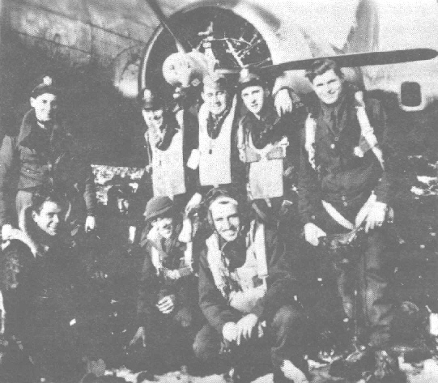

Abrams Crew Photos

 

The Abrams Crew  
  

  

Mort Abrams crew after bringing B-17 44-8283 down on Januay 16, 1945   

in a cabbage patch in Belgium with three feathered props.  

Standing L to R: Abrams, Black, Whittaker, Steiner, Hall  

Kneeling L to R: Langdon, Zell, Brown, Reo.  

The Plane, "Lucky 13," later renamed "Dinah-Mite," was subsequently lost,   

ditched in the English Channel on April 5, 1945 with the Mehling crew.
  
  

[BACK TO THIS CREW'S COMBAT RECORD](ValorToVictory/crews/Abrams.md)  

[TO THIS PLANE'S COMBAT RECORD](ValorToVictory/b17s/44-8283.md)  

[BACK TO CREW INDEX PAGE](ValorToVictory/000crews.md)  

[BACK TO MAIN PAGE](ValorToVictory/index.html)

