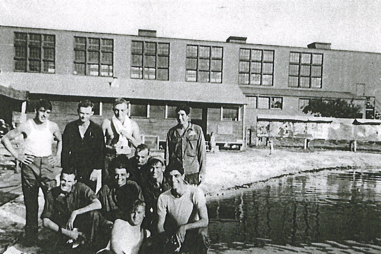

Agegian Crew Photos

 

Agegian Crew  
  

  

Photo: Agegian crewmember.  

The Agegian crew at Drew Field, Tampa, FL in 1944 during Ditching Procedure Practice.  

Standing L-R: Duane Beaver (CP), Red Boner (R), George Jorgenson (N) and Jim Black (E).  

Middle Row L-R: Hugh B. Farrington (Tog), Artie Trapp (BG) and John Wright (TG).  

Lower Row L-R: Harry C. Arnold (WG) and Martin Agegian (P).  

10th person unidentified.  
  

  

Photo: 34BG Assoc., MM156.  

Standing (L-R): Duane R. Beaver (CP), George L. Boner (R), Hugh B. Farrington (Tog.), Arthur G. Trapp (BG), and Martin J. Agegian (P).  

Kneeling (L-R): Harry C. Arnold (WG), John H. Wright (TG) and James D. Back, Jr. (E).  

Not Pictured: George H. Jorgenson (N).  

  
  

[BACK TO THIS CREW'S COMBAT RECORD](../crews/Agegian.md)  

[BACK TO CREW INDEX PAGE](../000crews.md)  

[BACK TO MAIN PAGE](../index.md)

