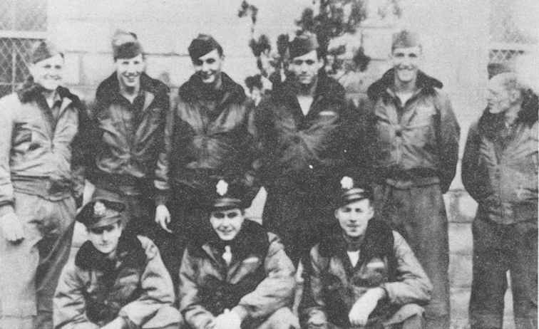

Autry Crew Photos

 

Autry Crew  
  

  

Photo: 34BG Assoc., MM144. (Mar. 1986\)  

Standing L-R: Jay Buxton, Bob Cole, Francis Head, Roy Ballentine, Ted Bacalis and Dave Pflumb.  

Kneeling L-R: Dick Cutting, Elwin Autry and Jim Hanrahan.  

  

[BACK TO THIS CREW'S COMBAT RECORD](ValorToVictory/crews/Autry.md)  

[BACK TO CREW INDEX PAGE](ValorToVictory/000crews.md)  

[BACK TO MAIN PAGE](ValorToVictory/index.html)

