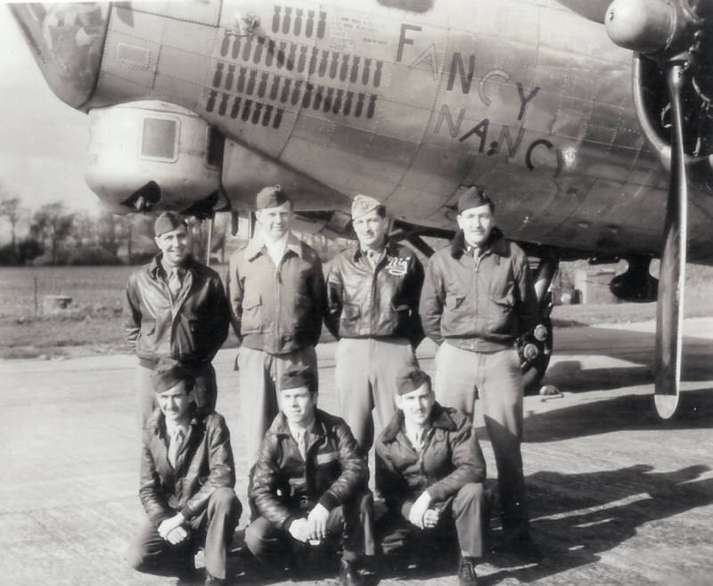

Barbaras Crew Photos

 

The Barbaras Crew  
  

  

Part of the BARBARAS Crew with Fancy Nancy, 44-6465.  

Back Row L to R.: Fredette; Robert Sweeney; Barbaras; Ellis.  

Front Row: Johnson; "Amigo" Reyes; Hagler.  

Eisenberg is not pictured, because he was still in the hospital with the bloody finger.  
 Eisenberg had been WIA in Fancy Nancy on the 25 February 1945 mission.  
  

[BACK TO THIS CREW'S COMBAT RECORD](crews/Barbaras.md)  

[BACK TO CREW INDEX PAGE](000crews.md)  

[BACK TO MAIN PAGE](index.html)

