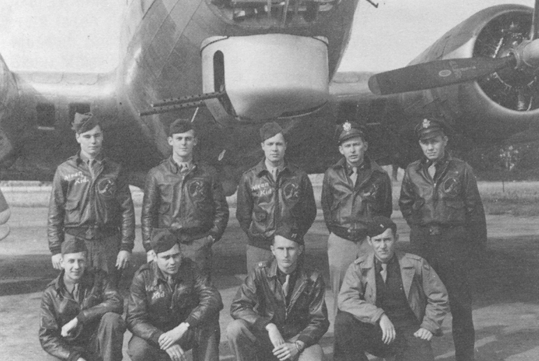

Blackburn Crew Photos

 

Blackburn Crew  
  

  

Photo: 34BG Assoc., MM104.  

The Blackburn crew on September 17, 1944\.  

Names, not in order: Robert C. Pearce (B), John B. Oyster (R), Robert Huebler (TT), Curtis Orr (N),   
John Wolf (WG), John J. Denter (G), James R. Blackburn (P), and Elmer T. Lian (CP).  
  

[BACK TO THIS CREW'S COMBAT RECORD](../crews/Blackburn.md)  

[BACK TO CREW INDEX PAGE](../000crews.md)  

[BACK TO MAIN PAGE](../index.md)

