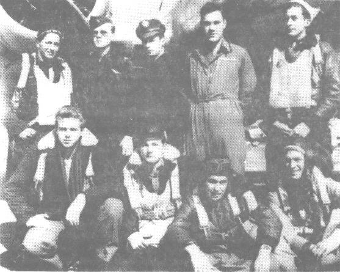

Crew Photos

 

The Blair Crew  
  

  

Photo: 34BG Assoc., MM008. (Mar. 1985\)  

The John Blair Crew  

Standing L to R: Walter Scott (E), Doug Underwood (B), Lewis Wright (CP), John Blair (P) and Tony Trutancih (N)  

Kneeling: Richard Turpin (R), James A. Clemmems, Bobbie Corbin, Myron Philips.  
  

[BACK TO THIS CREW'S COMBAT RECORD](crews/Blair.md)  

[BACK TO CREW INDEX PAGE](000crews.md)  

[BACK TO MAIN PAGE](index.html)

