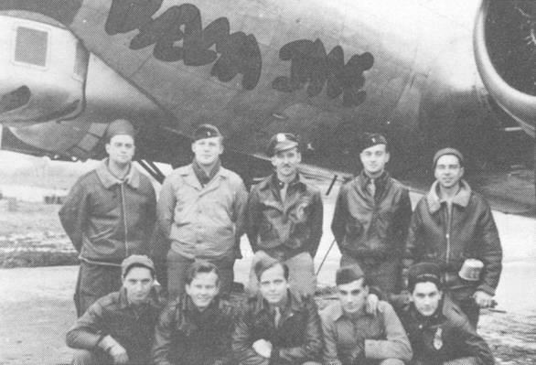
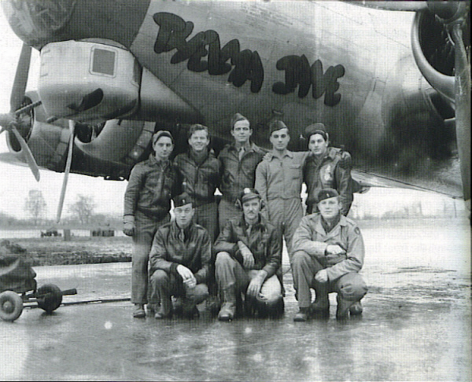

Bowen Crew Photos

 

Bowen Crew  
  

  

Photo: 34BG Assoc., MM108.  

Top row (l-r): unidentified Crew Chief, John Rosequist, Louis Bowen, John Northrup, and unidentified ground crewman.  

Bottom row (l-r): Louis Tamburro, Arthur Massey, Bill Jones, Jack Borders, and Albert J. Russo.  

Not pictured: Harold O. Madion.  
  

  

Another photo of the Bowen Crew with Themla Jane.  
  

[BACK TO THIS CREW'S COMBAT RECORD](ValorToVictory/crews/Bowen.md)  

[BACK TO CREW INDEX PAGE](ValorToVictory/000crews.md)  

[BACK TO MAIN PAGE](ValorToVictory/index.html)

