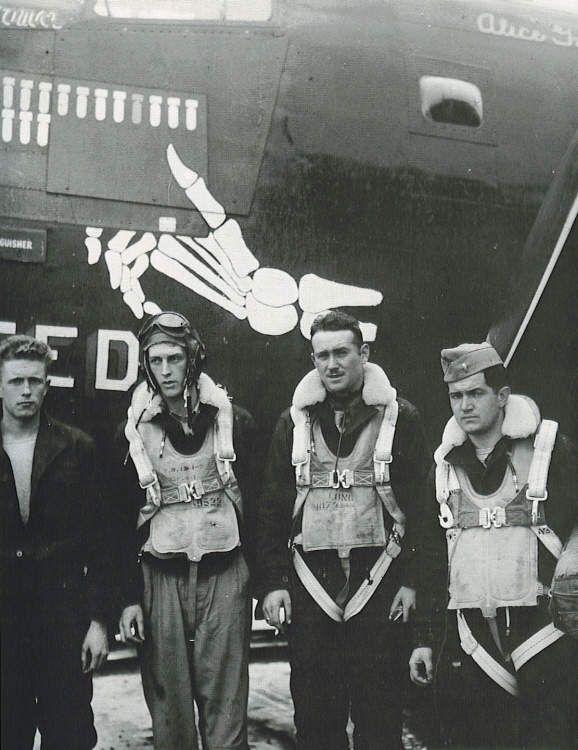
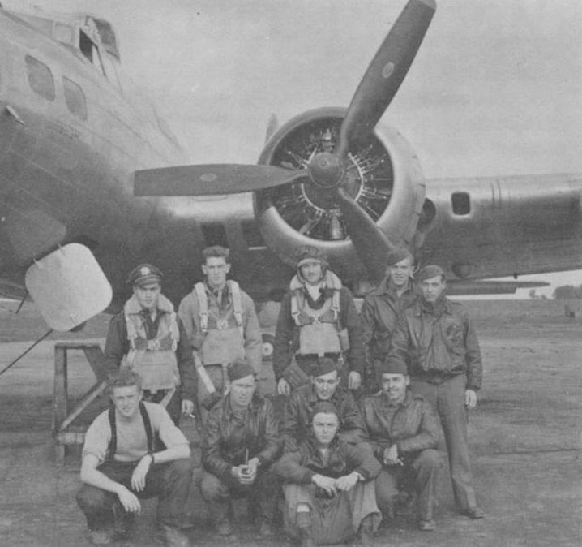

Crew Photos

 

T. D. Coupland Crew  
  

  

L-R: H. R. McNeill, Bombardier; T. D. Coupland, Pilot; L. S. Robinson, Co-Pilot; and R. H. McCal, Navigator.  

This photo was confusing for some time as it showed this crew with a plane they never flew. I finally figured out from the mission markers on The Uninvited, that this photo dates from around August 1, 1944, which is after the Coupland crew's regular plane, Frivolous Sal, had been lost while being flown by a different crew.  
  

  

Photo 34BG Assoc., MM356  

The Coupland Crew after the switch to B-17s.  

Standing L-R: (Nav unk), Hobart McNeil (B), L. S. Robinson (CP), unk., T. D. Coupland (P)  

Kneeling: James Stewart, Michael Zapach, James Jordan, Morris Rosenweig and Robert Burnett.  
  

[BACK TO THIS CREW'S COMBAT RECORD](../crews/Coupland.md)  

[BACK TO CREW INDEX PAGE](../000crews.md)  

[BACK TO MAIN PAGE](../index.md)

