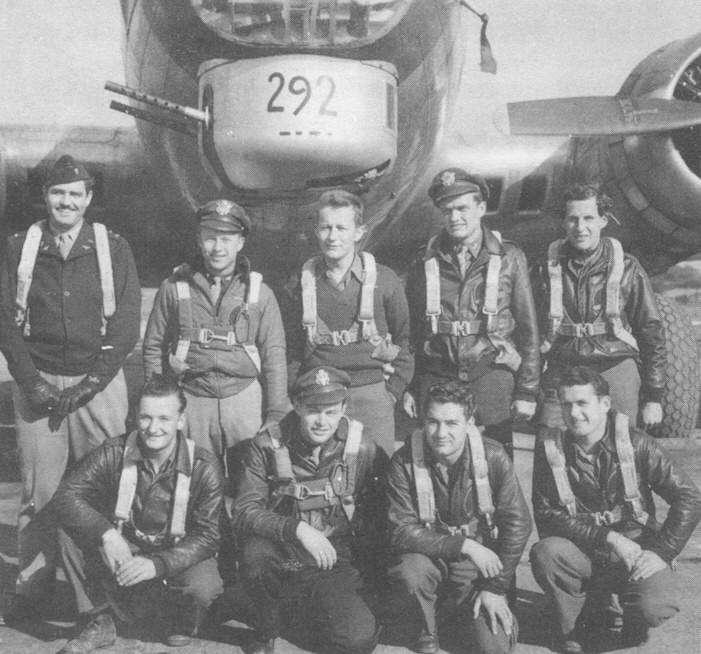

Dees Crew Photos

 

Dees Crew  
  

  

Photo: 34BG Assoc., MM059.  

The Dees Crew after their final mission on December 6, 1944, the only time they flew in 43-38292, "Conga Babe."  

Standing L-R: Don Rankin, John Dozier, Harold Fondren, C. Wrightsman and Cliff Lattin.  

Kneeling L-R: Vince Hosack, Robert Dees, Robert Aldrich and Steve Walch.  

  

[BACK TO THIS CREW'S COMBAT RECORD](../crews/Dees.md)  

[BACK TO CREW INDEX PAGE](../000crews.md)  

[BACK TO MAIN PAGE](../index.md)

