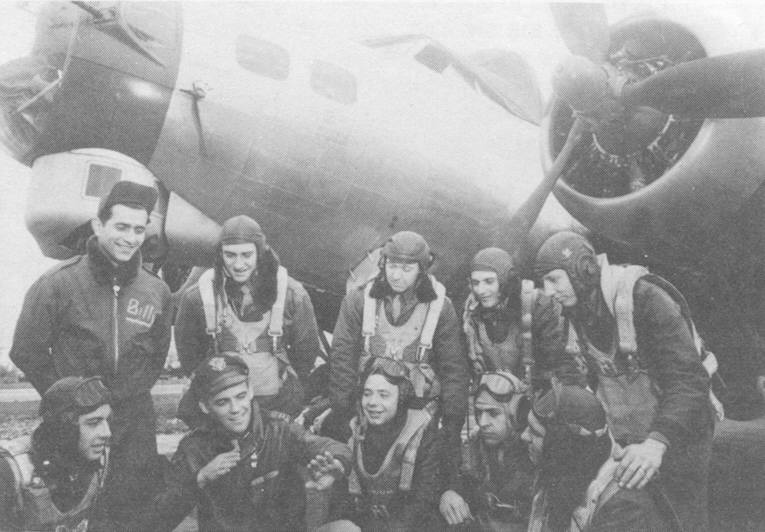

Isaacs Crew Photos

 

Isaacs Crew  
  

  

Photo: 34BG Assoc., MM102.  

Standing (l-r): Billy ?, Eddie K. Jines, Ed Rabun, Bert Oliver, and James R. Mason.  

Kneeling (l-r): Seymour Isaacs, Capt. Petersen (pilot of P-51 Hurry Home Honey), William Munter, Robert Platz, and Ken Hood.
  
  

[BACK TO THIS CREW'S COMBAT RECORD](ValorToVictory/crews/Isaacs.md)  

[BACK TO CREW INDEX PAGE](ValorToVictory/000crews.md)  

[BACK TO MAIN PAGE](ValorToVictory/index.html)

