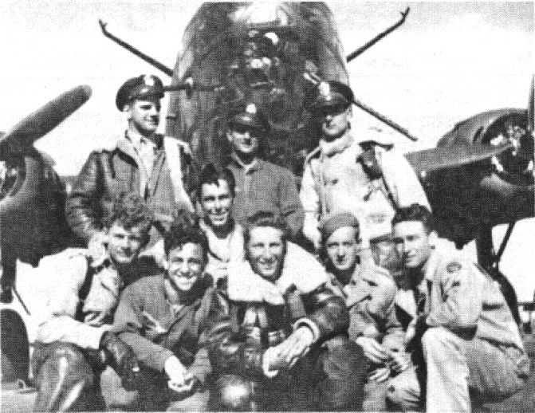
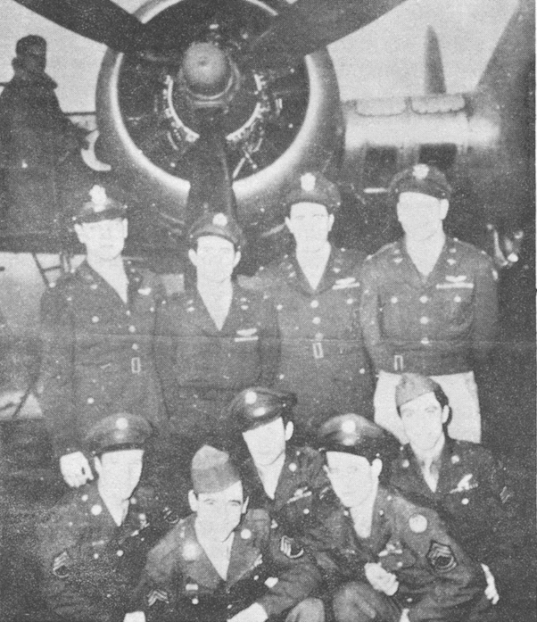

Crew Photos

 

Johanson Crew  
  

  
  

  

Photo: 34BG Assoc., MM140. (Mar. 1986\)  

Standing L-R: Robert McWay, Vincent Lombardo, Robert Griffis and Alf Johanson.  

Kneeling L-R: Alvin Sadowsky, Leonard Adrignoca, Raymond Trotter, Bennie Copeland and Jamer Hunter.  

The mechanic in the background is unknown.  
  

[BACK TO THIS CREW'S COMBAT RECORD](ValorToVictory/crews/Johanson.md)  

[BACK TO CREW INDEX PAGE](ValorToVictory/000crews.md)  

[BACK TO MAIN PAGE](ValorToVictory/index.html)

