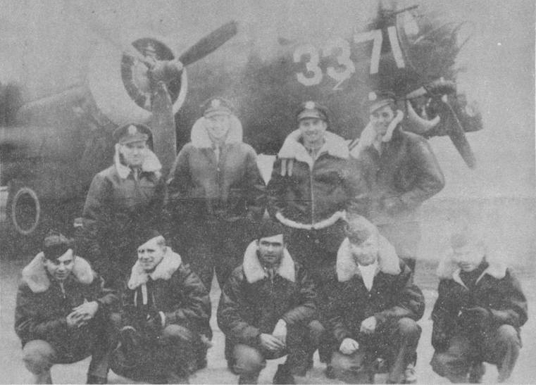

Kenny Crew Photos

 

Kenny Crew  
  

  

Photo: 34BG Assoc., MM028.  

The Kenny Crew while stateside with a training B-17.  

Standing L-R: Jim Kenny (P), George Muellerschoen (CP), Bill Gombos (N) and Conley Ferguson (B).  

Kneeling L-R: Jim Buegler (BG), Ray Snow (WG), Roy Smith (TG), Walter Johnson (E) and Ernie Waite (R).  
  

[BACK TO THIS CREW'S COMBAT RECORD](../crews/Kenny.md)  

[BACK TO CREW INDEX PAGE](../000crews.md)  

[BACK TO MAIN PAGE](../index.md)

