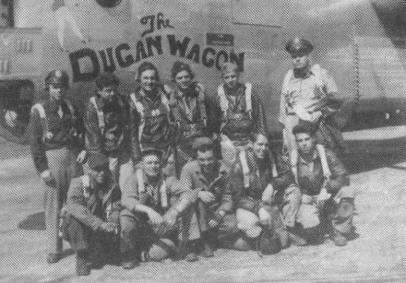

Lindstrom Crew Photos

 

Lindstrom Crew  
  

  

Photo: 34BG Assoc., MM007. (Mar. 1985\)  

With The Dugan Wagon, 44-40482.  

Standing (l-r): William Hammil (CP), Bennie Crawford (TG), Gordon Breeding (AG), George Morris (B), and Russell Lindstrom (P).  

Kneeling (l-r): Clarence Squires (asst. Crew Chief), Walter Aturdivan (R), James Harkless (Crew Chief), Truman Wingo (G), and Harold Witham (E).  
  

[BACK TO THIS CREW'S COMBAT RECORD](ValorToVictory/crews/Lindstrom.md)  

[BACK TO CREW INDEX PAGE](ValorToVictory/000crews.md)  

[BACK TO MAIN PAGE](ValorToVictory/index.html)

