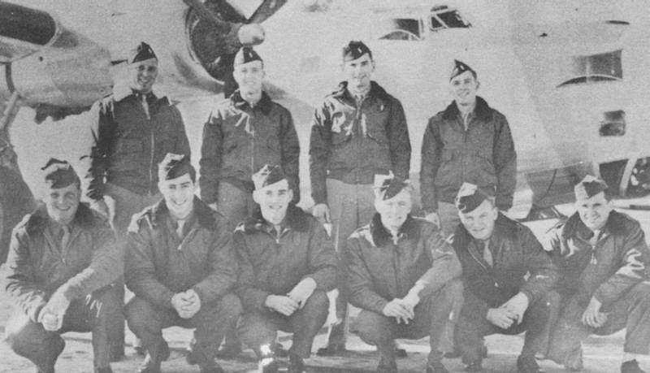

S. Martin Crew Photos

 

Stanley Martin Crew  
  

  

Photo: 34BG Assoc., MM040.  

The Stanley Martin Crew while in stateside training with a B-24M in the background.  

Standing L-R: Stanley Martion, Raymond Swan, Earl Colebank and William Robertson.  

Kneeling L-R: Joe McCarrick, Jerry Becker, Ed Logan, P. T. Walker, Ned Piency and Andfy Oschack.  
  

[BACK TO THIS CREW'S COMBAT RECORD](ValorToVictory/crews/MartinS.md)  

[BACK TO CREW INDEX PAGE](ValorToVictory/000crews.md)  

[BACK TO MAIN PAGE](ValorToVictory/index.html)

