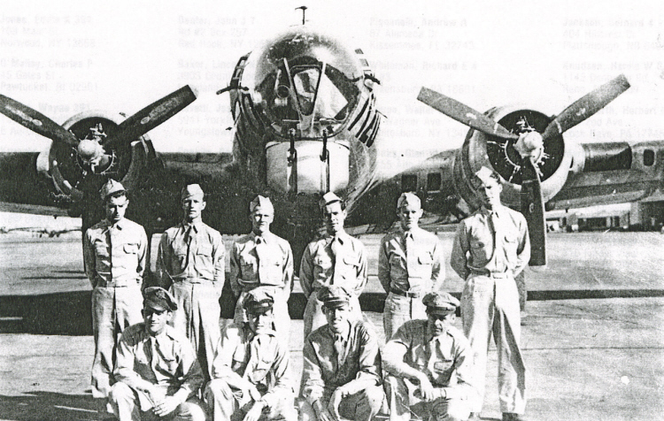

Crew Photos

 

Parkhurst Crew  
  

  

Photo: 34BG Assoc., MM454.  

The Parkhurst crew in the US with training B-17G #7120.  

Standing L-R: J. Huling, Ken Lockwood, William Ilka, C. Keist, J. Fowler and R. Chaney.  

Kneeling L-R: F. Parkhurst (P), D. Mote (CP), C. Yarbrough (N) and L. Fossum (B).  
  

[BACK TO THIS CREW'S COMBAT RECORD](crews/Parkhurst.md)  

[BACK TO CREW INDEX PAGE](000crews.md)  

[BACK TO MAIN PAGE](index.html)

