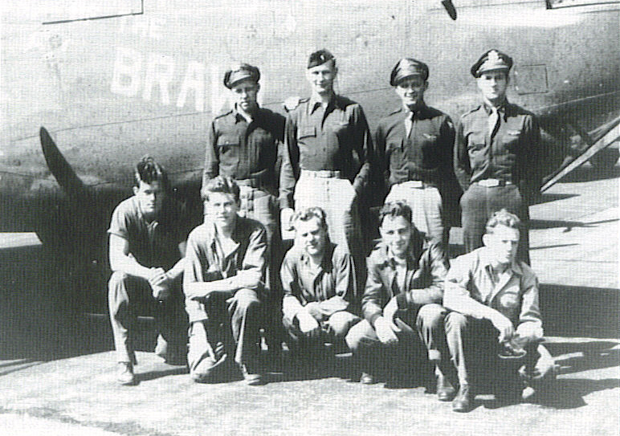

Paulnock Crew Photos

 

Paulnock Crew  
  

  

Photo: 34BG Assoc., MM386.  

With Belle of the Brawl, 42-94904.  

Standing (L-R): James L. Bartels (B), Walter M. Baskin (CP), Russell S. Paulnock (P), and Erling A. Barseth (N).  

Kneeling (L-R): J. L. Edwards (G), Donald K. Fillman (E), Alfred Woollacott, Jr. (R), Jim Reilly (TG), and James W. McCarthy, Jr. (G).  

NOTE: This photo was taken after Reilly joined the crew near the end of July 1944 and before Walter Baskin was given command of his own crew in September 1944\.
  
  

[BACK TO THIS CREW'S COMBAT RECORD](crews/Paulnock.md)  

[BACK TO CREW INDEX PAGE](000crews.md)  

[BACK TO MAIN PAGE](index.html)

