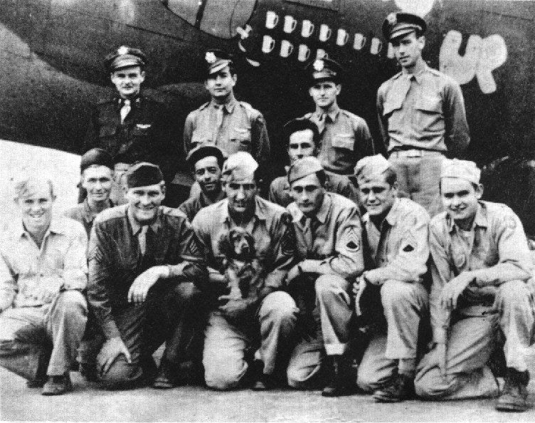
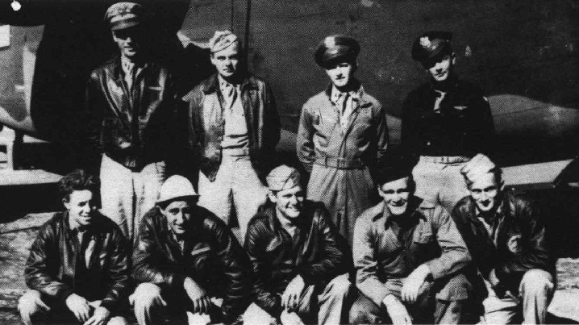

Pavlicek Crew Photos

 

Pavlicek Crew  
  

  

Photo: 34BG Assoc., MM245.  

The Pavlicek crew with "Set 'em Up" 42-94787.  

Photo: 34BG Assoc., MM456.  

Standing L-R: C. Pavlicek, H. Glover, H. Graham and W. Vernuille.  

Center L-R: D. Spher, T. Mascarella and K. Westenburger, Ground Crewmen.  

Kneeling L-R: W. Griffis, M. Chapman, J. Crouch with the dog, H. Crawford, R. Hendricks and W. Oneschak.  
  
  
  

Standing L \- R: Walter O. Verneuille (CP), Charles B. Pavlicek (P), Herbert W. Graham (N), Halsey S. Glover (B).  

Kneeling L \- R: Willis W. Griffis (E), John H. Crouch (R), Robert L. Hendricks (G), McDonald D. Chapman (G), Harry J. Crawford (G).  
  

[BACK TO THIS CREW'S COMBAT RECORD](crews/Pavlicek.md)  

[BACK TO CREW INDEX PAGE](000crews.md)  

[BACK TO MAIN PAGE](index.html)

