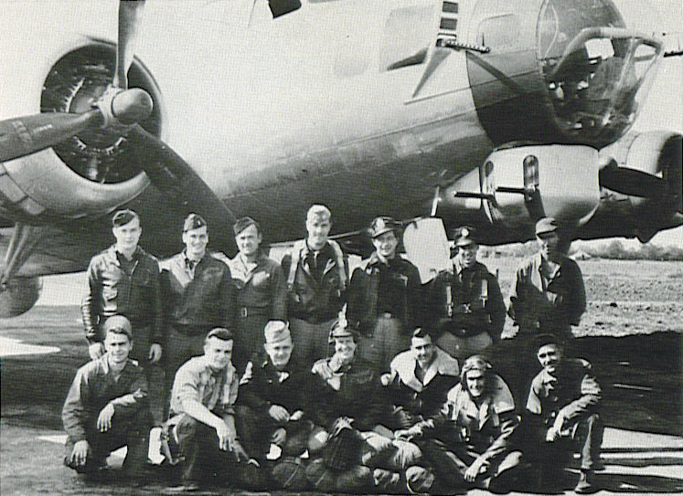

Crew Photos

 

Ralls Crew  
  

  

Photo: 34BG Assoc., MM105.  

Standing (L-R): Don Hughley (R), Albert Juris (N), Harold Moran (G), Emery Ralls (P), Harold Wanfried (PN), Carl Westman (CP), and unidentified ground crewman.  

Kneeling (L-R): unidentified gound crewman, Clayton Gable (E), Stan Kowalczyk (TG), Earl Parenteau (B), John Zelenski (NG), Manuel Markes (BG), and Wesley Franklin (Crew Chief).
  
  

[BACK TO THIS CREW'S COMBAT RECORD](crews/Ralls.md)  

[BACK TO CREW INDEX PAGE](000crews.md)  

[BACK TO MAIN PAGE](index.html)

