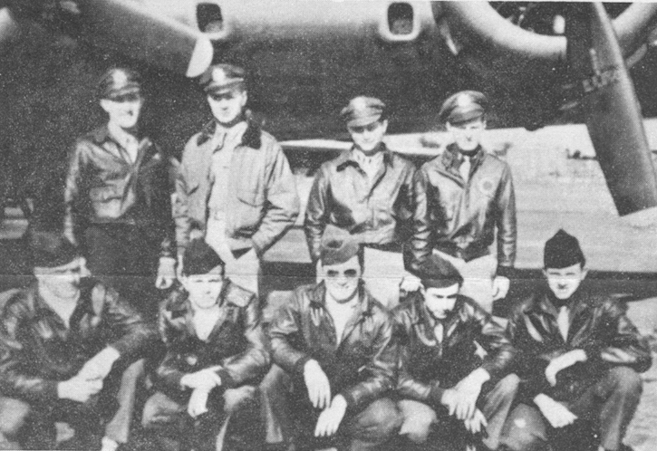

Sheridan Crew Photos

 

Sheridan Crew  
  

  

Photo: 34BG Assoc., MM141. (Mar. 1986\)  

Standing L-R: Jim Sheridan, Hank Gauger, Milt Braverman and John Pelly.  

Kneeling L-R: Si Slovenske, Phillips, Bob Scheutz, Sanders and Keith SAndholm.  

  

[BACK TO THIS CREW'S COMBAT RECORD](ValorToVictory/crews/Sheridan.md)  

[BACK TO CREW INDEX PAGE](ValorToVictory/000crews.md)  

[BACK TO MAIN PAGE](ValorToVictory/index.html)

