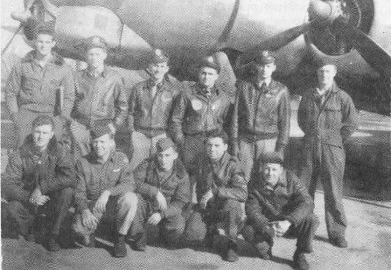

Sherman Crew Photos

 

Sherman Crew  
  

  

Photo: 34BG Assoc., MM003. (Mar. 1985\)  

Standing L-R: Ira Mansfield (WG), Jeff Hawkins (N), Cecil Net... (B), Blaine Evans (CP), Larry Sherman (P) and unknown.  

Kneeling L-R: Harry Chomiak (R), Andy Anderson (BG), Warren Schadle (E/TT), John Hickey (WG) and unknown.  

The Tail Gunner, Bob Schlindwein is not pictured.  

  

[BACK TO THIS CREW'S COMBAT RECORD](ValorToVictory/crews/Sherman.md)  

[BACK TO CREW INDEX PAGE](ValorToVictory/000crews.md)  

[BACK TO MAIN PAGE](ValorToVictory/index.html)

