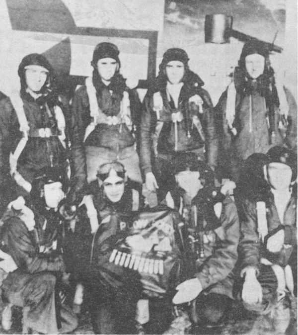

Springer Crew Photos

 

Springer Crew  
  

  

Photo: 34BG Assoc., MM133 (Mar. 1986\)  

From the Flight Jacket, it appears the Springer crew B-17 was named "Plow Jockey."  

Standing L-R: Douglas Braham, Daniel Marks, Fred Fielder and Richard Polak.  

Kneeling L-R: Clinton Beard, Fred Edelstein, Robert Springer and Anton Rysak.  

  

[BACK TO THIS CREW'S COMBAT RECORD](../crews/Springer.md)  

[BACK TO CREW INDEX PAGE](../000crews.md)  

[BACK TO MAIN PAGE](../index.md)

