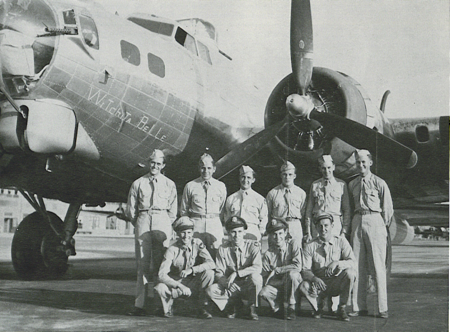

Weeks Crew Photos

 

Talbott Crew  
  

  

The Talbott Crew with "Witchita Belle," a training aircraft based in the US.  

Standing (l-r): Al Phomse Fruit, Joe "Moe" Howamec, Lombard, John Melneck, Bill Stewart, and Robert Jacobs.  

Kneeling (l-r): John T. Lyons, Talbott, Lucien L. Rainey, and Ainsa.  
  

[BACK TO THIS CREW'S COMBAT RECORD](ValorToVictory/crews/Talbott.md)  

[BACK TO CREW INDEX PAGE](ValorToVictory/000crews.md)  

[BACK TO MAIN PAGE](ValorToVictory/index.html)

