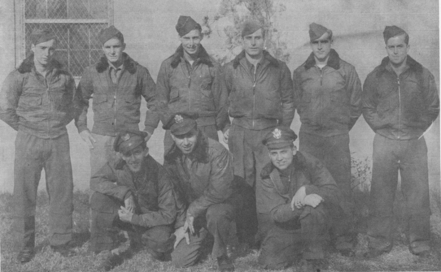

Thaete Crew Photos

 

Thaete Crew  
  

  

Photo: 34BG Assoc., MM250.  

The Thaete Crew, whose regular plane was Evadin' Maiden, 44-6929.  

Standing L-R: Del Bainco, Sanders, Dulaney, Kardowsky, Olmstead and Joubert.  

Kneeling L-R: Guertin, Linden and Thaete.  
  

[BACK TO THIS CREW'S COMBAT RECORD](crews/Thaete.md)  

[BACK TO CREW INDEX PAGE](000crews.md)  

[BACK TO MAIN PAGE](index.html)

