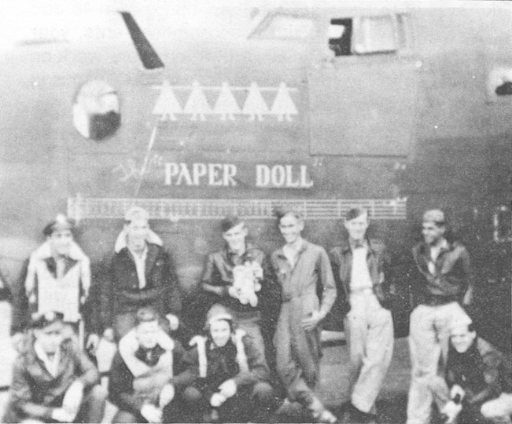
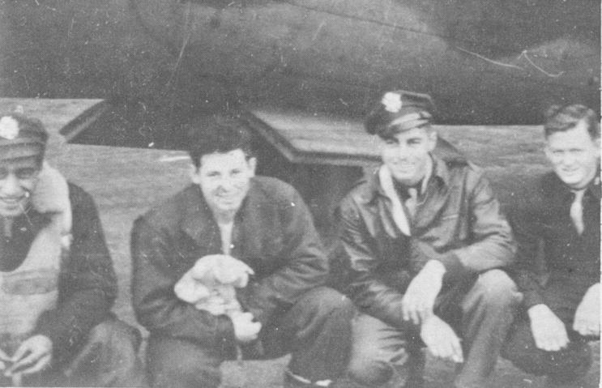
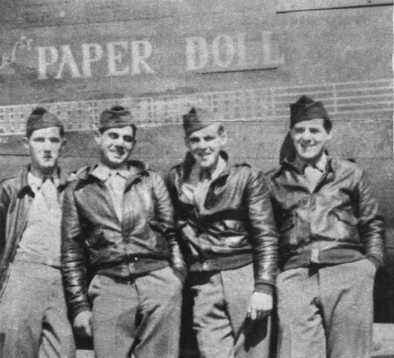

Crew Photos

 

Tuttle Crew  
  

  

Photo: 34BG Assoc., MM023. (Mar. 1986\)  

The Tuttle Crew with Paper Doll, 42-94799.  

  

  

Photo: 34BG Assoc., MM143. (Mar. 1986\)  

L-R: Francis Gullace (N), Evan Rogers (CP), Don Tuttle (P) and Earl Strong (B).  

  

  

Photo: 34BG Assoc., MM017. (Mar. 1986\)  

The first 34th Bomb Group airmen to complete a 35 mission tour of duty on August 13, 1944\.  

L-R: William Harrow, Leonard Chatoian, Charles Pell and Glenn Henry.  

  

[BACK TO THIS CREW'S COMBAT RECORD](../crews/Tuttle.md)  

[BACK TO CREW INDEX PAGE](../000crews.md)  

[BACK TO MAIN PAGE](../index.md)

