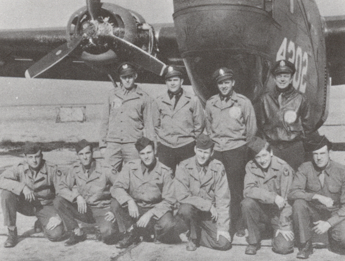

Tyson Crew Photos

 

Tyson Crew  
  

  

Photo: 34BG Assoc., MM352  

The Tyson Crew during stateside training. In combat they flew only B-17s.  

Standing L-R: Sragent, Tyson, (co-pilot) and (navigator).  

Kneeling L-R: Forth, Gilliland, Thompson, Merrell, Dalcher and Sater.  

  

[BACK TO THIS CREW'S COMBAT RECORD](crews/Tyson.md)  

[BACK TO CREW INDEX PAGE](000crews.md)  

[BACK TO MAIN PAGE](index.html)

