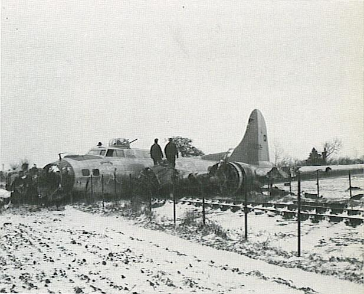

Photos of Gallopin' Ghost

 

43-38332 Gallopin' Ghost  
  

  

Picture taken January 20, 1945 after the plane crashed on take off killing two crew members.  

  

[BACK TO THIS PLANE'S COMBAT RECORD](ValorToVictory/b17s/43-38332.md)  

[BACK TO B-17 INDEX PAGE](ValorToVictory/000b17s.md)  

[BACK TO MAIN PAGE](ValorToVictory/index.html)

