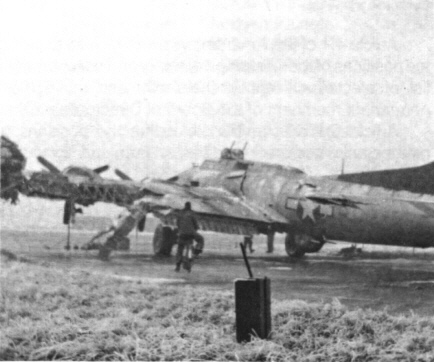
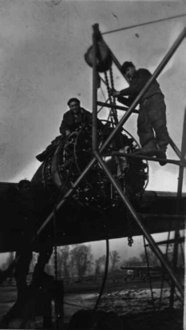

Photos of 43-38403

 

43-38403  
  

  

Picture taken after the landing collisions on Christmas Eve 1944\.  

This was the only one of the planes involved to ever fly again.  

The Crew Chief of this plane was Dexter Jordan.  

  

  

Photo: Dex Jordan  

After the landing collisions of December 24, 1944, Dexter (on the engine) and his crew, Daye (almost hidden by the wing) and Paul Schommer (on the rig) are beginning to change an engine on 43-38403.  

[BACK TO THIS PLANE'S COMBAT RECORD](ValorToVictory/b17s/43-38403.md)  

[BACK TO B-17 INDEX PAGE](ValorToVictory/000b17s.md)  

[BACK TO MAIN PAGE](ValorToVictory/index.html)

