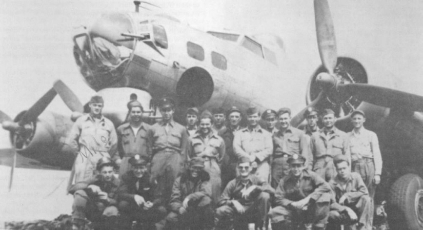

Photos of B-17

 

43-38820 Roll Me Over  
  

  

Photo: 34BG Assoc., MM310.  

The Goetz crew and passengers that flew this former 94th BG plane back to the U.S.A. after the war.  
  

[BACK TO THIS PLANE'S COMBAT RECORD](ValorToVictory/b17s/43-38820.md)  

[BACK TO B-17 INDEX PAGE](ValorToVictory/000b17s.md)  

[BACK TO MAIN PAGE](ValorToVictory/index.html)

