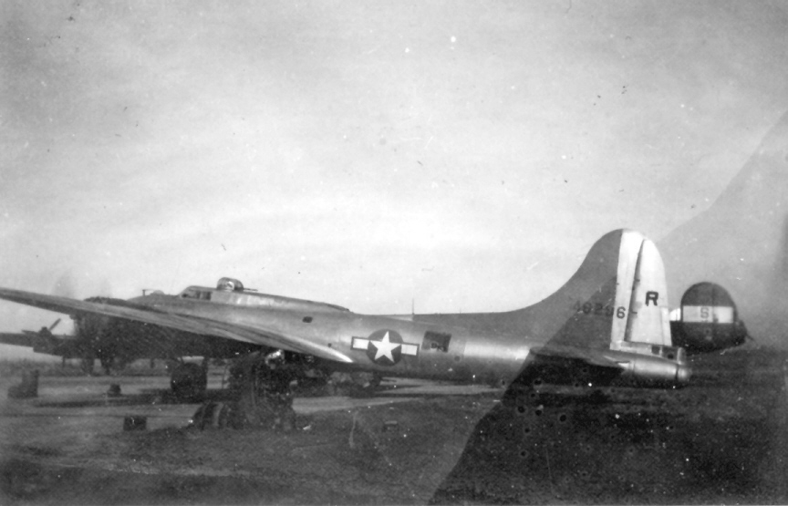

Photos of B-17s

 

44-6296 name unknown  

  
  

  

This plane was photographed at Station A-74 in France. It had landed there March 8, 1945 with two engines out, #1 and #4. Since the photo shows the #1 prop spinning, it probably was taken after the engines were changed and the plane was ready to return to Mendlesham. Station A-74 was Cambrai-Niergnies in France, base for the 394th BG B-26 Mauraders from October 10th 1944 to May 7th 1945\.  

Photo submitted by Alf Egil Johannessen of Sandefjord, Norway.  

Photo Credit: M/SGT Bernard Leroy Oligschlaeger (1921-1976) USAAF \- Gunner/Radioman in 394th BG / 586th BS (The Bridge Busters).  
  

[BACK TO THIS PLANE'S COMBAT RECORD](b17s/44-6296.md)  

[BACK TO B-17 INDEX PAGE](000b17s.md)  

[BACK TO MAIN PAGE](index.html)

