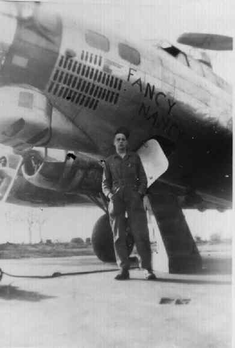
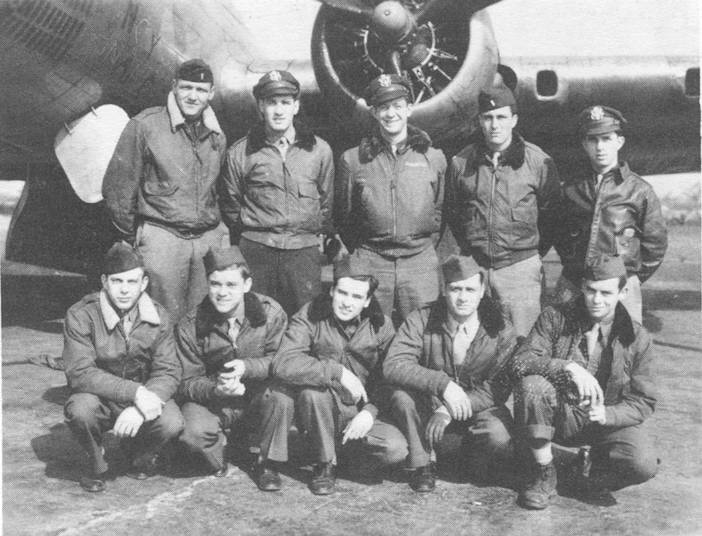
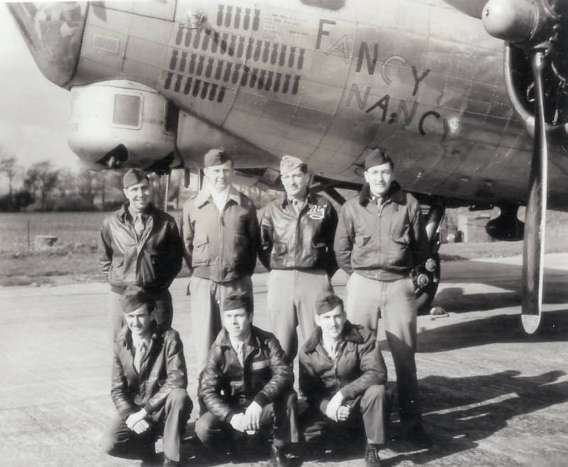
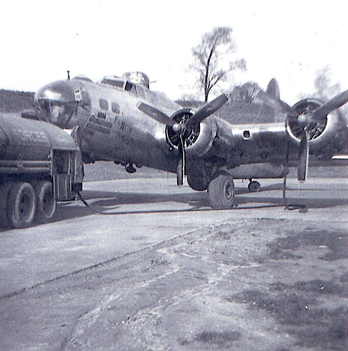

Photos of 44-6465

 

44-6465 Fancy Nancy  
  

  

Moe Henrichsen with Fancy Nancy  
  

  

Photo: 34BG Assoc., MM092.  

The HICKS crew with Fancy Nancy.  

Standing (L-R): Vanderkley, Cocherell, Johnson, Hicks, \& Nichols.  

Kneeling (L-R): Springman, Conklin, McArdle, Dunn \& Lotspeich.  
  

  

Part of the BARBARAS Crew with Fancy Nancy  

Back Row L to R.: Fredette; Robert Sweeney; Barbaras; Ellis.  

Front Row: Johnson; "Amigo" Reyes; Hagler.  

Eisenberg is not pictured, because he was still in the hospital with the bloody finger.  
 Eisenberg had been WIA in Fancy Nancy on the 25 February 1945 mission.  
  

  
  

[BACK TO THIS PLANE'S COMBAT RECORD](ValorToVictory/b17s/44-6465.md)  

[BACK TO B-17 INDEX PAGE](ValorToVictory/000b17s.md)  

[BACK TO MAIN PAGE](ValorToVictory/index.html)

