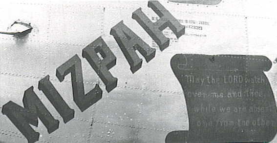
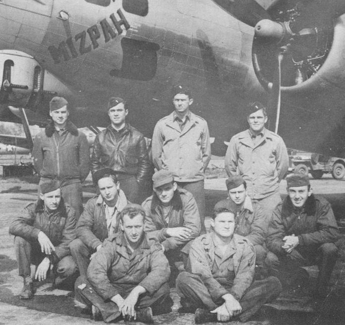

Photos of Mizpah

 

44-6939 Mizpah  
  

  
  

  

Photo: 34BG Assoc., MM039.  

Mizpah with the Stemen Crew  

Back row (l-r): Clifford Greiman (R), Joel Friedman (B-N), Charles Davis (CP), and Carl Stemen (P).  

Middle row (l-r): Rex Corothers (BG), Oren Hopkins (G), John R. Oliver (G), Stephen Kopacz, and Donald Kregar (Tog).  

Front row (l-r): Kenneth Ulm, Crew Chief and Wayne Wright, Ground Crew.
  
  

[BACK TO THIS PLANE'S COMBAT RECORD](b17s/44-6939.md)  

[BACK TO B-17 INDEX PAGE](000b17s.md)  

[BACK TO MAIN PAGE](index.html)

