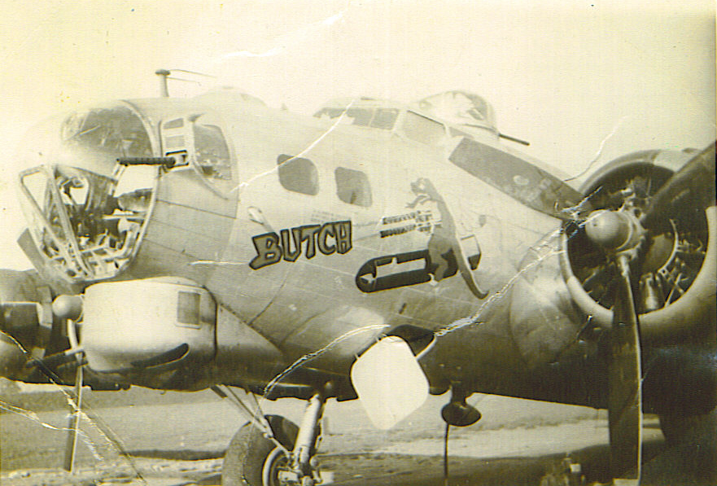
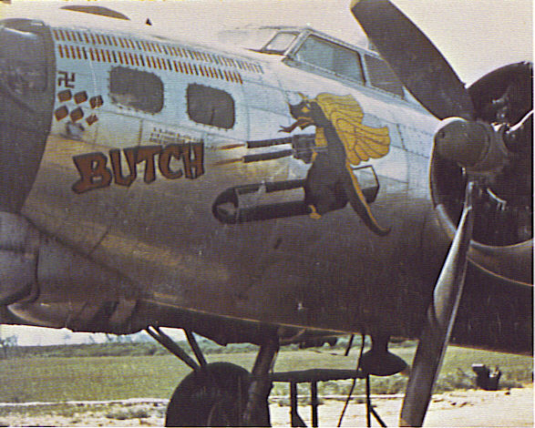
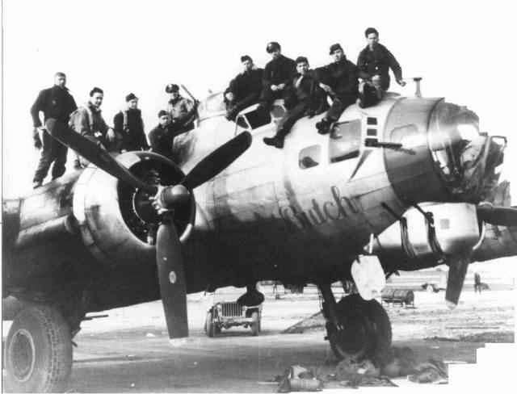
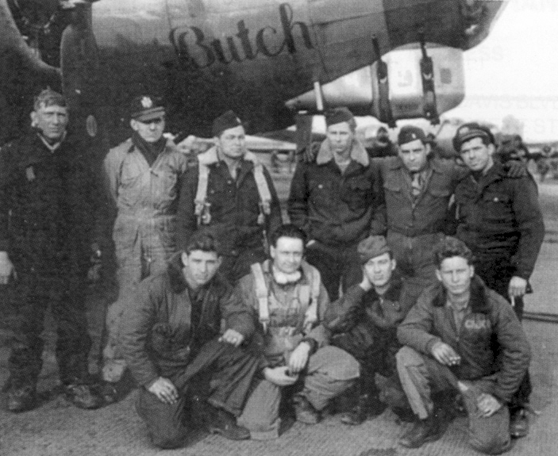

Photos of B-17

 

44-8271 Butch  
  

  
  

  
  

  
  

  

Photo: 34BG Assoc., MM367.  

Butch with the Hammersley Crew.  

Standing L-R: Schroeder (TG), unknown, Inman (CP), Adams (E), Hammersley (P), McGovern (B).  

Kneeling L-R: Stivender (R), Funk (Photographer), Small (BG) and Thurner (WG).  
  

[BACK TO THIS PLANE'S COMBAT RECORD](ValorToVictory/b17s/44-8271.md)[BACK TO B-17 INDEX PAGE](ValorToVictory/000b17s.md)  

[BACK TO MAIN PAGE](ValorToVictory/index.html)

