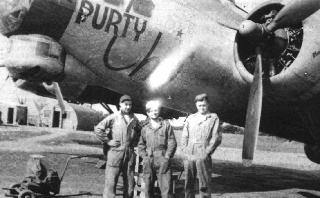
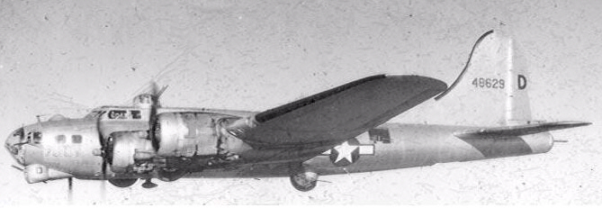
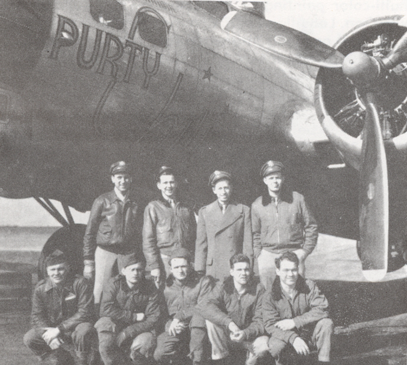

Photos of 44-8629

 

44-8629 Purty Chili  
  

This plane is said to have been named after movie starlet Chili Williams.  
  

  

The Ground Crew: (l-r) Cpl. Edmund Bouty, M/Sgt. Mike Sass; unidentified.  
  

  
  

  

Photo: 34BG Assoc., MM350.  

Purty Chili with the D. F. Hansen Crew.  

Standing L-R: Sacherman, Des Lauriers, Hansen and Wathey.  

Kneeling L-R: Young, McClellan, Green, Griffin and Shoaf.  

  

[BACK TO THIS PLANE'S COMBAT RECORD](ValorToVictory/b17s/44-8629.md)  

[BACK TO B-17 INDEX PAGE](ValorToVictory/000b17s.md)  

[BACK TO MAIN PAGE](ValorToVictory/index.html)

