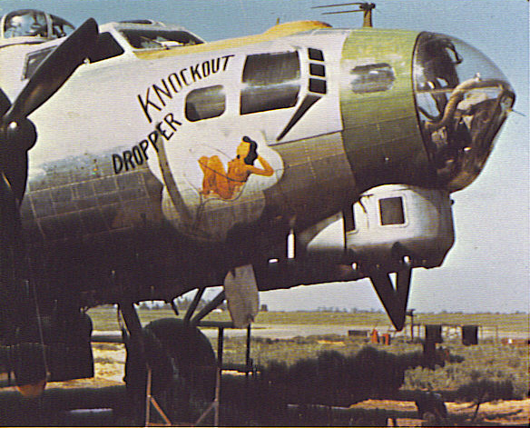
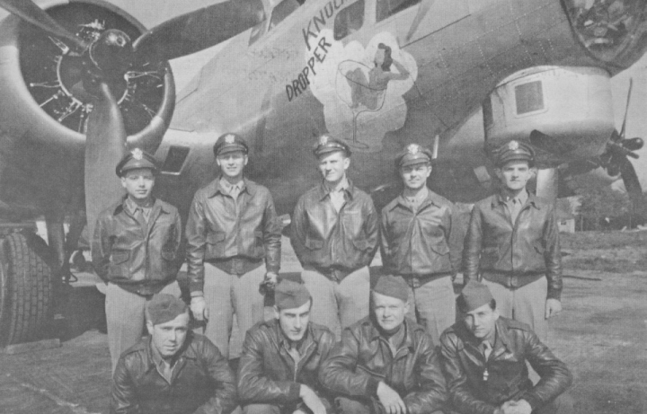

Photos of B-17

 

44-8731 Knockout Dropper  
  

  
  

  

Photo: 34BG Assoc., MM371.  

Knockout Dropper with the Sain Crew.  

Standing L-R: Abe Firestone, James Sain, Hugh Goerner, Don Stuffelbeam and Tony Scimeca.  

Kneeling L-R: Lloyd Shilkett, Edward Durbin, Floyd Richmond and Harry Hoffman.  
  

[BACK TO THIS PLANE'S COMBAT RECORD](ValorToVictory/b17s/44-8731.md)  

[BACK TO B-17 INDEX PAGE](ValorToVictory/000b17s.md)  

[BACK TO MAIN PAGE](ValorToVictory/index.html)

