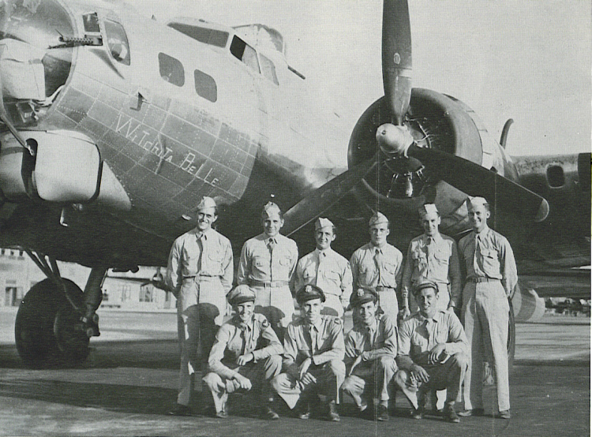

Photos of B-17

 

Whichita Belle  

unknown serial number  
  

  
  

The Talbott Crew with "Witchita Belle," a training aircraft based in the US.  

Standing (l-r): Al Phomse Fruit, Joe "Moe" Howamec, Lombard, John Melneck, Bill Stewart, and Robert Jacobs.  

Kneeling (l-r): John T. Lyons, Talbott, Lucien L. Rainey, and Ainsa.  
  

[BACK TO B-17 INDEX PAGE](../000b17s.md)  

[BACK TO MAIN PAGE](../index.md)

