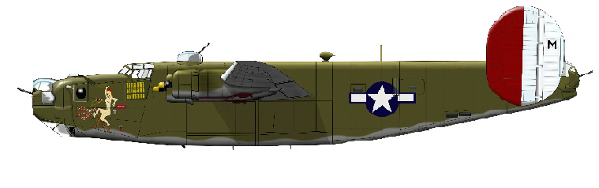
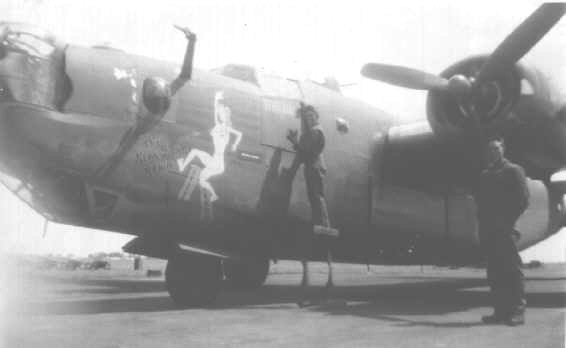
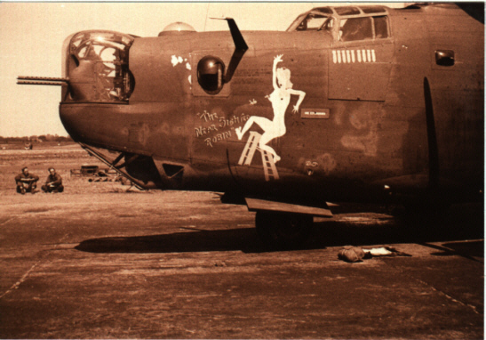
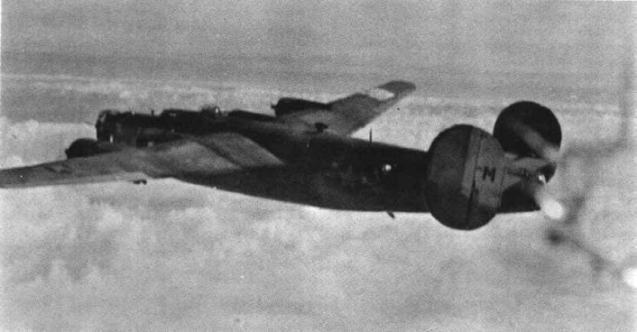
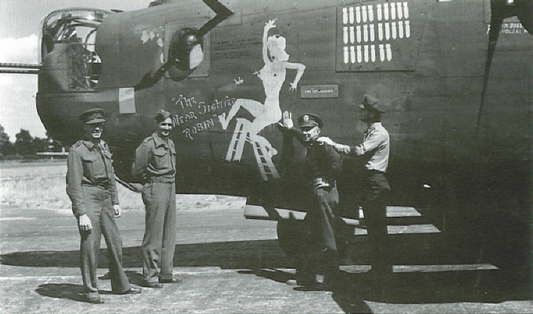
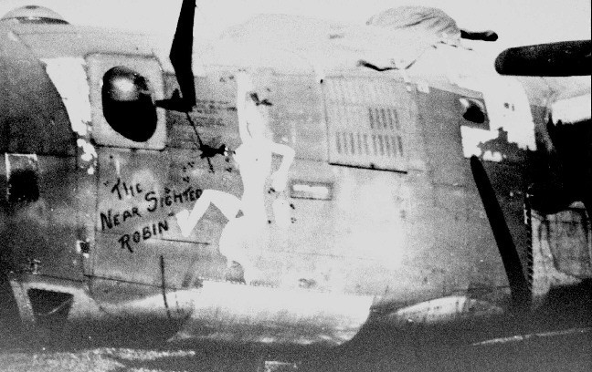
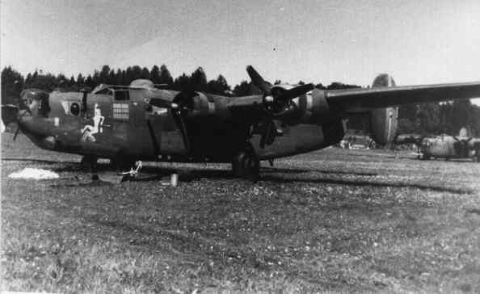

Photos of 41-28851 The Near Sighted Robin

 

41-28551 The Near Sighted Robin  
  

  

This computer painting of "The Robin," as it appeared in late August 1944, was done by Ingemar Melin of Sweden.  
  

  

Crew Chief Dexter Jordan painting on the 9th mission marker.  
  

  

The noseart after the first nine missions.  
  

  

Possibly The Near Sighted Robin, in flight in late July or August 1944\.  

(The other possiblity would be Smitty, Letter M in the 391st Squadron.)  
  

  

The Robin, after 27 missions.  
  

  

A close-up of the noseart while in Sweden, with 30 mission markers applied.  
  

  

The Near Sighted Robin resting in a field in Sweden following its internment.  
  

[BACK TO THIS PLANE'S COMBAT RECORD](../b24s/41-28851.md)  

[BACK TO B-24 INDEX PAGE](../000b24s.md)  

[BACK TO MAIN PAGE](../index.md)

