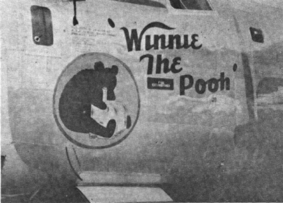
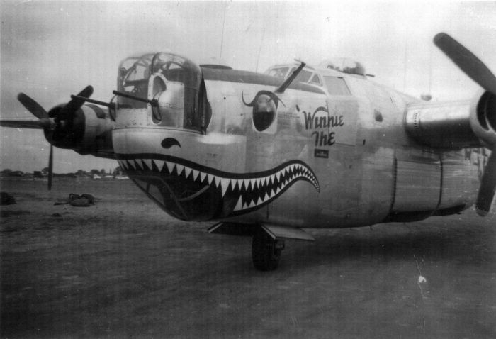

Photos of B-24s

 

41-28880 Winnie the Pooh  
  

  
  

  

Photo: Chris Lane  

This plane was transferred to the 486BG where the new Sharkmouth markings were added and the old Winnie the Pooh markings at this point were only partially removed. When this aircraft returned to the 34th BG in late July 1944, it carried the Sharkmouth markings from its 486th BG days.  
  

See the link below for another photo of this aircraft from the other side.   

[Photo on 486BG site](http://www.486th.org/Photos/Aircraft/Ghost.md)  
  

[BACK TO THIS PLANE'S COMBAT RECORD](../b24s/41-28880.md)  

[BACK TO B-24 INDEX PAGE](../000b24s.md)  

[BACK TO MAIN PAGE](../index.md)

