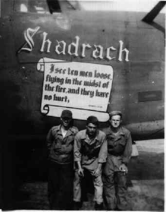
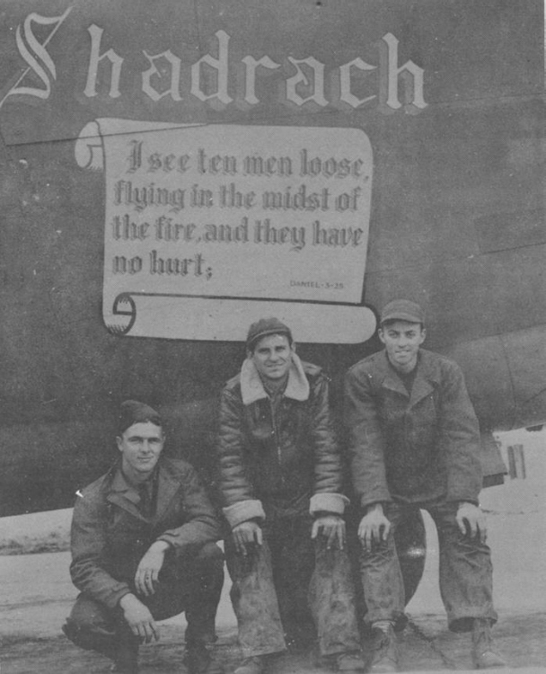
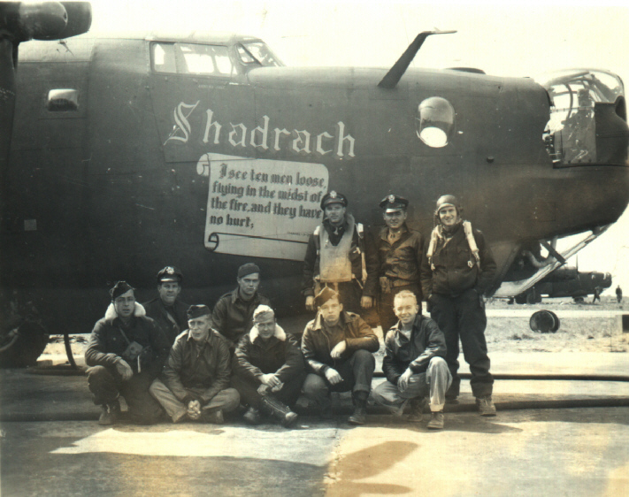
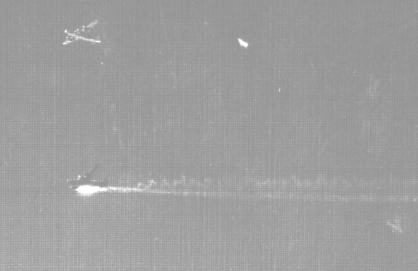

Photos of 

 

41-29557 unknown, then Shadrach (#2)  
  

  
  

  

Photo: 34BG Assoc., MM360.  

L-R: unknown, Chester Antkowiak, Crew Chief and Clyde Sudderth.  
  

  
  

  

August 5, 1944\. The Terry crew is hit and going down in Shadrach.  
  

[BACK TO THIS PLANE'S COMBAT RECORD](b24s/41-29557.md)  

[BACK TO B-24 INDEX PAGE](000b24s.md)  

[BACK TO MAIN PAGE](index.html)

