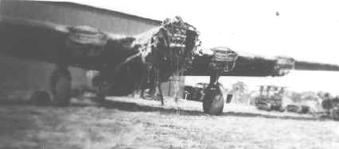

Photos of B-24s

 

41-29559 Blechin' Bessie  
  

  

Blechin' Bessie as a Hanger Queen, the aftermath of the accident August 11, 1944\.   
  

[BACK TO THIS PLANE'S COMBAT RECORD](ValorToVictory/b24s/41-29559.md)  

[BACK TO B-24 INDEX PAGE](ValorToVictory/000b24s.md)  

[BACK TO MAIN PAGE](ValorToVictory/index.html)

