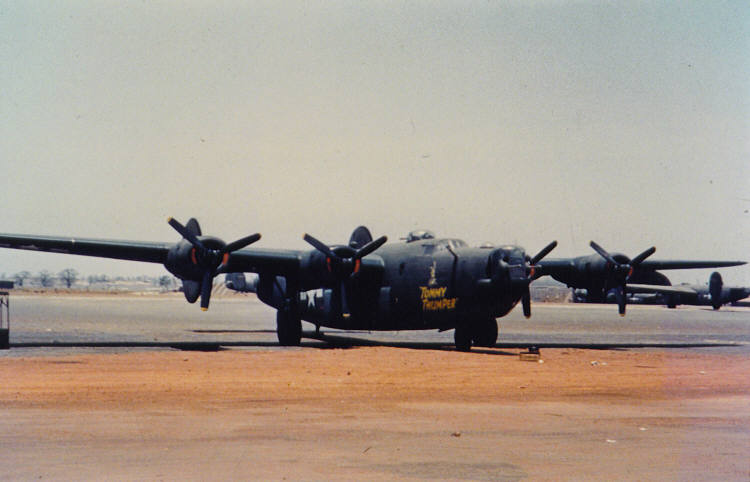
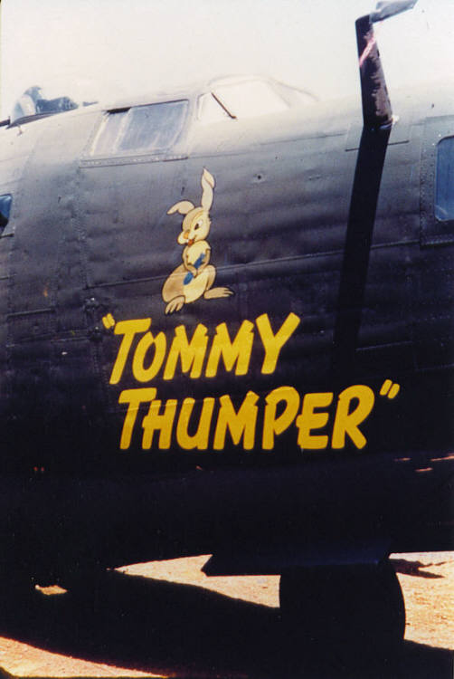
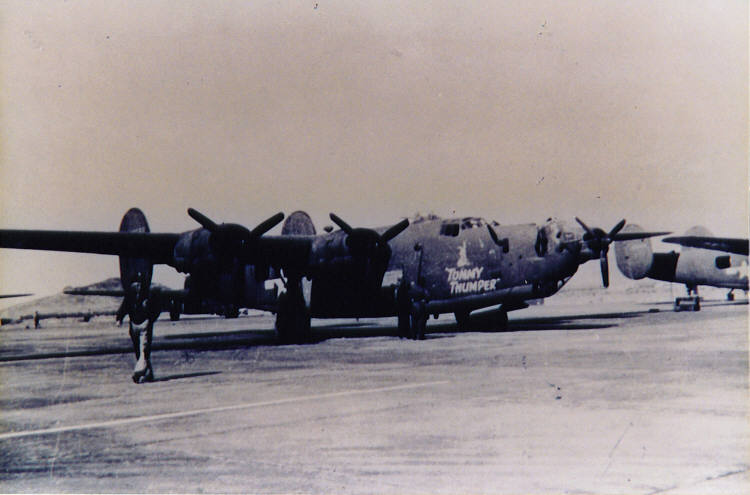
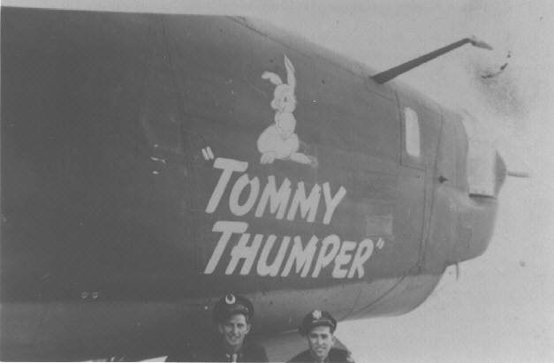

Photos of 

 

41-29562 Tommy Thumper  
  

  
  

  
  

  
  

  
  

This is the original 34th BG, “Tommy Thumper,” which was damaged May 12, 1944 in a landing accident while being flown by the Pedigo crew on a training flight. This plane never flew combat. This plane was flown to England by the Thrun crew and his crew was given another plane, which they named “Tommy Thumper II.”  
  

[BACK TO THIS PLANE'S COMBAT RECORD](ValorToVictory/b24s/41-29562.md)  

[BACK TO B-24 INDEX PAGE](ValorToVictory/000b24s.md)  

[BACK TO MAIN PAGE](ValorToVictory/index.html)

