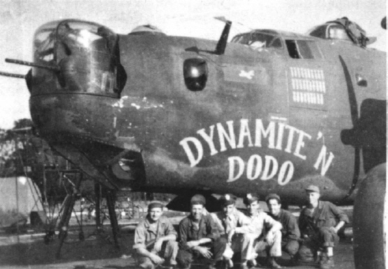
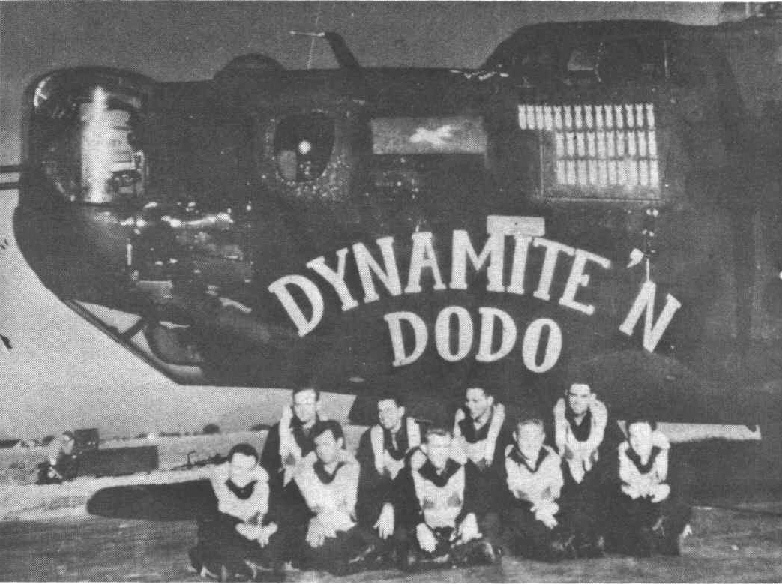

Photos of 

 

42-52755 Dynamite 'N Dodo  
  

  

Photo: 34BG Assoc., MM196.  

Thought to be the only heavy bomber in the 8th AF to shot down a V-1 Buzz Bomb.  

Left to Right: Long, Larsen, Williamson, Tardiff, unknown and Wallace.  
  

  

Photo: 34BG Assoc., MM037.  

With the Noble Wright Crew.  

Back Row L-R: Deacon Scales, Tommy Hildebrand, Ziggie Gordon and "Doc" Wright.  

Front Row L-R: Bill Starks, Tom Devine, George Baldwin, "Cotton" Hudson and Delmont Jones.  
  

[BACK TO THIS PLANE'S COMBAT RECORD](b24s/42-52755.md)  

[BACK TO B-24 INDEX PAGE](000b24s.md)  

[BACK TO MAIN PAGE](index.html)

