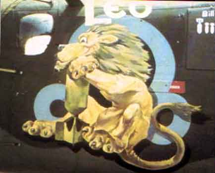
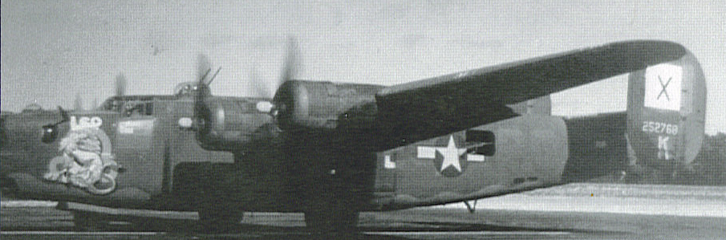

Photos of 

 

42-52768 Leo   

(First B-24 so named while with 486BG.)  
  

  
  

  

Shown while serving with the 493rd BG.  
  

[BACK TO THIS PLANE'S COMBAT RECORD](b24s/42-52768.md)  

[BACK TO B-24 INDEX PAGE](000b24s.md)  

[BACK TO MAIN PAGE](index.html)

