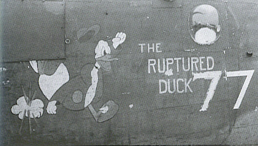
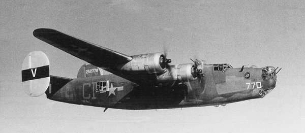

Photos of 

 

42-52770 Ruptured Duck  
  

  
  

  

Photographed after leaving the 34th Bomb Group.  

For some reason, the nose art has been removed.   
  

[BACK TO THIS PLANE'S COMBAT RECORD](ValorToVictory/b24s/42-52770.md)  

[BACK TO B-24 INDEX PAGE](ValorToVictory/000b24s.md)  

[BACK TO MAIN PAGE](ValorToVictory/index.html)

