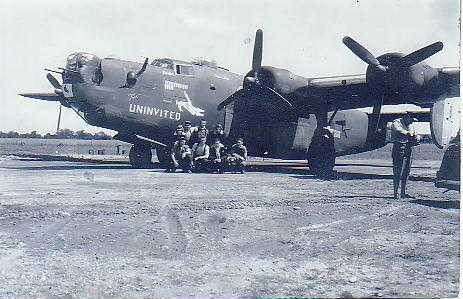
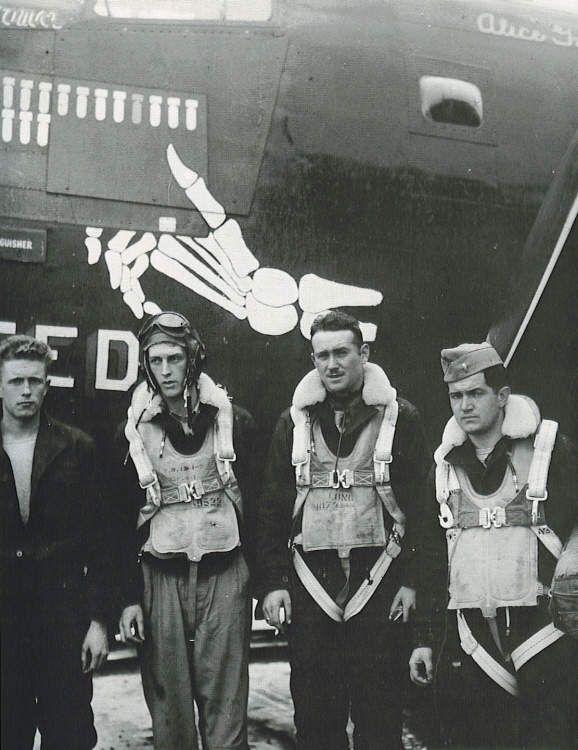

Photos of B-24s

 

42-94762 The Uninvited  
  

  

This photo shows the Coupland crew, but they never flew a combat mission in this plane. By the time this photo was taken (about August 1st, judging by the mission markers) Coupland's regular plane, Frivolous Sal, had already been lost with another crew.  
  

  

A closer view, again with part of the Coupland Crew.  
  

[BACK TO THIS PLANE'S COMBAT RECORD](ValorToVictory/b24s/42-94762.md)  

[BACK TO B-24 INDEX PAGE](ValorToVictory/000b24s.md)  

[BACK TO MAIN PAGE](ValorToVictory/index.html)

