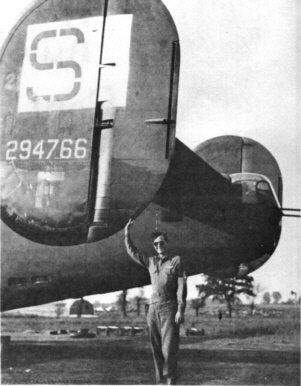

Photos of B-24s

 

42-94766 Crow's Nest  

  
  

Sgt. Litsey, a photographer, later Killed in Action.  

This Photo shows well the early "Square S" Group Marking carried on the upper right wing and on the tail.  
  

[BACK TO THIS PLANE'S COMBAT RECORD](ValorToVictory/b24s/42-94766.md)  

[BACK TO B-24 INDEX PAGE](ValorToVictory/000b24s.md)  

[BACK TO MAIN PAGE](ValorToVictory/index.html)

