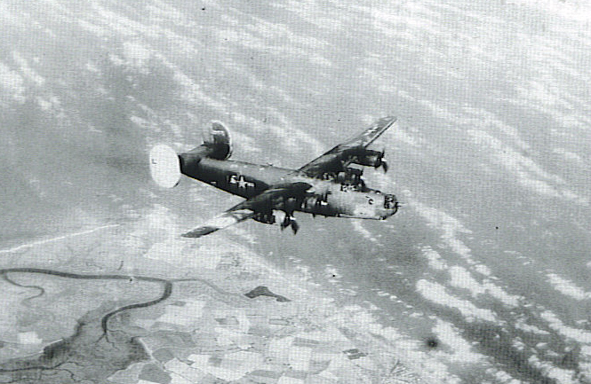

Photos of B-24s

 

42-94775 (unknown name)  

  

Photo: 34th BG Assoc.  

In flight over England, July or August, 1944\.  
  

[BACK TO THIS PLANE'S COMBAT RECORD](ValorToVictory/b24s/42-94775.md)  

[BACK TO B-24 INDEX PAGE](ValorToVictory/000b24s.md)  

[BACK TO MAIN PAGE](ValorToVictory/index.html)

