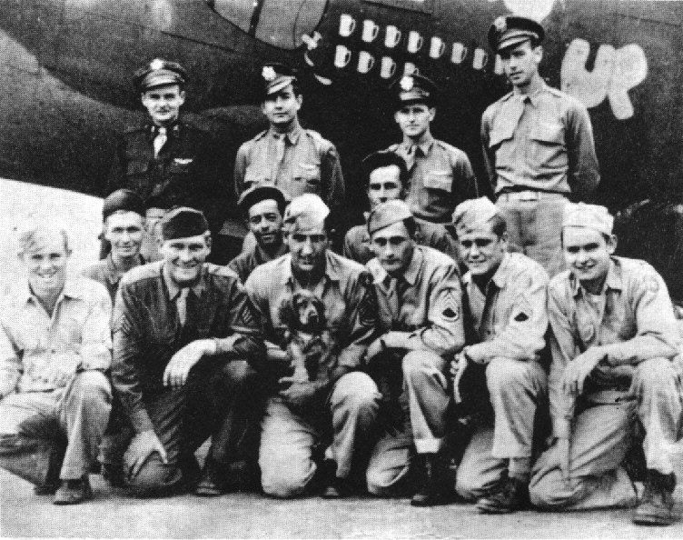
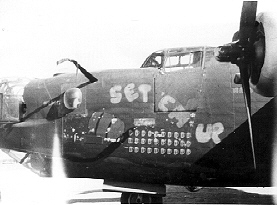
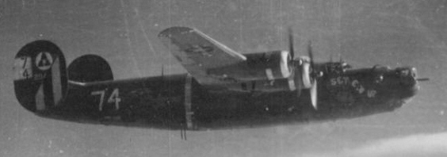

Photos of B-24s

 

42-94787 Set 'em Up  
  

  

Photo: 34BG Assoc., MM245.  

The Pavlicek crew with "Set 'em Up."  

Standing L-R: C. Pavlicek, H. Glover, H. Graham and W. Vernuille.  

Center L-R: D. Spher, T. Mascarella and K. Westenburger, Ground Crewmen.  

Kneeling L-R: W. Griffis, M. Chapman, J. Crouch with the dog, H. Crawford, R. Hendricks and W. Oneschak.  
  

  
  

  

This photo shows Set 'em Up while serving in the 15th Air Force   

after leaving the 34th Bomb Group.  
  

[BACK TO THIS PLANE'S COMBAT RECORD](ValorToVictory/b24s/42-94787.md)  

[BACK TO B-24 INDEX PAGE](ValorToVictory/000b24s.md)  

[BACK TO MAIN PAGE](ValorToVictory/index.html)

