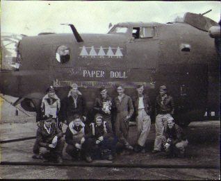
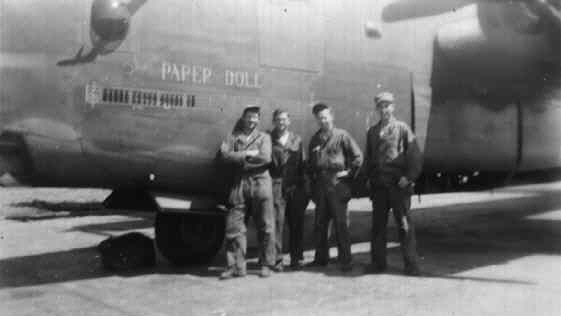
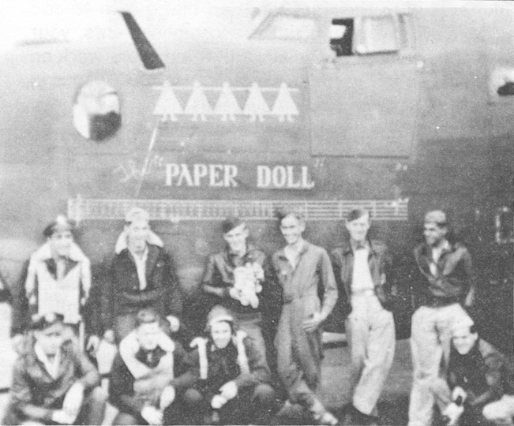
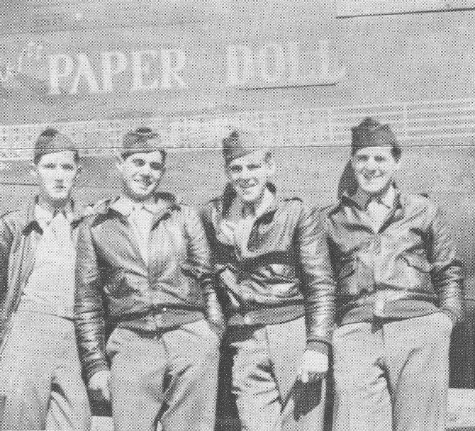

Photos of 

 

42-94799 The Paper Doll  
  

  
  

  
  

  

Photo: 34BG Assoc., MM023.  

Paper Doll with the Tuttle Crew, although they are not identified in this photo.  
  

  

Photo: 34BG Assoc., MM017.  

The first airmen to complete 35 missions, the last one on August 13, 1944\.  

L-R: William Harrow, Leonard Chatoian, Charles Pell and Glenn Henry.  
  

[BACK TO THIS PLANE'S COMBAT RECORD](../b24s/42-94799.md)  

[BACK TO B-24 INDEX PAGE](../000b24s.md)  

[BACK TO MAIN PAGE](../index.md)

