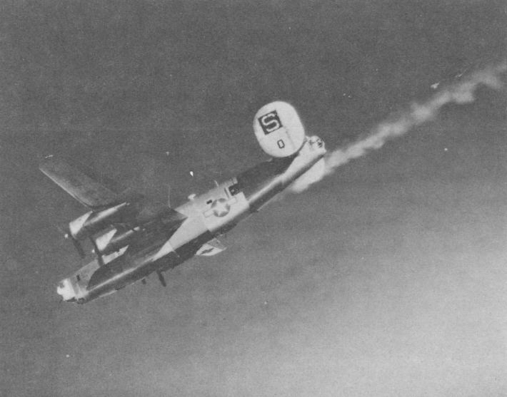
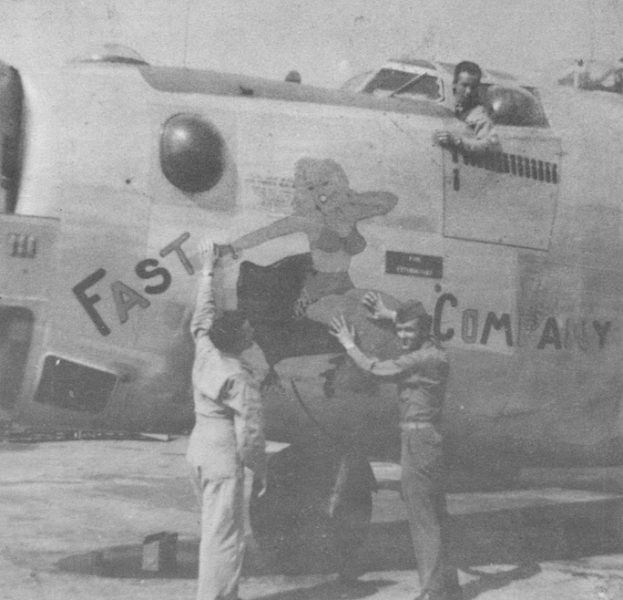

Photos of Fast Company

 

44-40420 Fast Company  
  

  

Photo: 34BG Assoc., MM248.  

This photo was most likely taken on June 24, 1944\. On this mission, Fast Company (prior to that name being applied) was piloted by Whited and apparently ran into some trouble. Two different landing times are reported for this plane on that mission. Depending on which one is correct, this plane arrived back at Mendlesham either approximately 30 minutes before the main group, or 30 minutes behind them. This is the only time in its first three missions when it left the formation and did not return with the main group. It is also to be noted that the plane did not fly its next combat mission until July 2, 1944, which would have been after the group marking change which deleted the Square S on the tail in favor of the front half being painted red.  
  

  

Lou Cohen in the cockpit, Dusty Rhodes and Roland Beach on the ground.  
  

[BACK TO THIS PLANE'S COMBAT RECORD](ValorToVictory/b24s/44-40420.md)  

[BACK TO B-24 INDEX PAGE](ValorToVictory/000b24s.md)  

[BACK TO MAIN PAGE](ValorToVictory/index.html)

